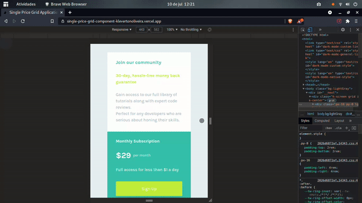

# Single Price Grid Component App (English / Português)
[](https://github.com/KlevertonOliveira/single-price-grid-component-NextJS/blob/main/LICENSE)

---

## :art: Layout web



---

[Project Presentation](https://single-price-grid-component-klevertonoliveira.vercel.app/) /
[Apresentação do Projeto](https://single-price-grid-component-klevertonoliveira.vercel.app/)

---

## :mag_right: About the project / Sobre o projeto

Single-Price-Grid-Component is an application developed as a solution to the [challenge](https://www.frontendmentor.io/challenges/single-price-grid-component-5ce41129d0ff452fec5abbbc) of the same name proposed by the website [Frontend Mentor](https://www.frontendmentor.io/). As a differential for the development of this application, I chose to use NextJS and TailwindCSS Frameworks in order to make the development faster and more responsive.

The application implements a grid with information about a promotion to purchase a specific product / service. As it is fully responsive, the application is suitable for viewing by devices with different screen sizes.

---

Single-Price-Grid-Component é uma aplicação desenvolvida como solução ao [desafio](https://www.frontendmentor.io/challenges/single-price-grid-component-5ce41129d0ff452fec5abbbc) de mesmo nome proposto pelo site [Frontend Mentor](https://www.frontendmentor.io/). Como diferencial para o desenvolvimento deste aplicativo, optei por utilizar os Frameworks NextJS e TailwindCSS com o intuito de tornar o desenvolvimento mais rápido e responsivo.

A aplicação implementa um grid com informações acerca de uma promoção para adquirir um determinado produto / serviço. Por ser totalmente responsiva, a aplicação atende a visualização por aparelhos com tamanhos de tela variados.

---

## :gear: Technologies Used / Tecnologias utilizadas

### Front end
- HTML5
- [Tailwind CSS](https://tailwindcss.com/) (CSS Framework)
- Javascript ES6
- [NextJS](https://nextjs.org/) (React Framework)

## :file_folder: How to run the project / Como executar o projeto

Prerequisites / Pré-requisitos: npm / yarn

```bash
# Clone repository / Clonar repositório
git clone https://github.com/KlevertonOliveira/single-price-grid-component-NextJS.git

# Enter the project folder / Entrar na pasta do projeto
cd single-price-grid-component-NextJS

# Install dependencies / Instalar dependências
yarn install

# Run the project / Executar o projeto
yarn dev or/ou yarn build && yarn start
```

## :raising_hand_man: Author / Autor

José Kleverton Yvens Oliveira

https://www.linkedin.com/in/klevertonoliveira/

